# Architecture Evolution Overview

This diagram summarizes, at a high level, the progression described across docs/study-guide/00 through 12. It is a visual index, not a replacement for the block-by-block detail.

```mermaid
flowchart LR
    A[Block 1: Stateful server] --> B[Block 2: Stateless server and database]
    B --> C[Block 3-4: Load balancer]
    C --> D[Block 5: Horizontal or vertical scaling]
    D --> E[Block 6: Microservices and API Gateway]
    E --> F[Block 7: Authentication and authorization]
    F --> G[Block 8: Presigned URLs and object storage]
    G --> H[Block 9: Event broker, async communication]
    H --> I[Block 10: Cache and CDN]
    I --> J[Block 11: Rate limiting]
```

## Status

This is a conceptual summary diagram derived directly from the study guide's own synthesis table (docs/study-guide/12-synthesis-and-study-path.md). No additional architectural claims beyond that table are represented here. If you need a more detailed component-level diagram (for example, showing the exact services in the src/ demos), please open an issue or contribute one, following docs/06-future-work.md.
